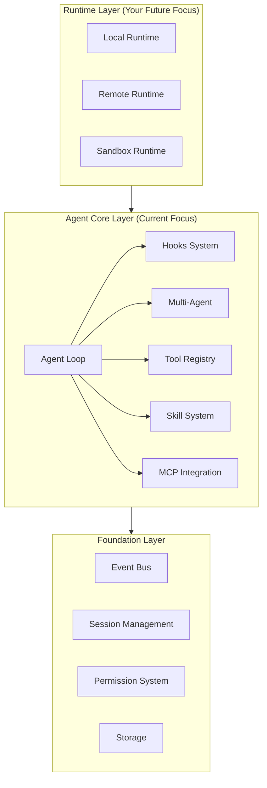

# Chord Code Agent Core 能力分析与 RoadMap

## 📊 当前状态 vs OpenCode 核心能力对比

### ✅ 已实现（v0.1.1）

| 能力 | Chord Code | OpenCode | 说明 |
|-----|-----------|----------|------|
| **Event Bus** | ✅ 完整 | ✅ | 基于 asyncio.Queue 的发布-订阅 |
| **Session/Message/Part** | ✅ 完整 | ✅ | Part 级别精确追踪 |
| **Tool Registry** | ✅ 基础 | ✅ 完整 | 目前仅 bash/read/write |
| **Permission System** | ✅ 基础 | ✅ 完整 | ask/allow/deny + approvals |
| **Streaming** | ✅ SSE | ✅ SSE | 实时推送事件 |
| **Interrupt** | ✅ | ✅ | 中断机制 |
| **Error Handling** | ✅ | ✅ | 完整错误捕获 |

### ❌ 缺失的核心能力（对比 OpenCode）

| 能力 | Chord Code | OpenCode | 重要性 | 说明 |
|-----|-----------|----------|--------|------|
| **Plugin/Hooks 系统** | ❌ | ✅ 完整 | 🔴 **极高** | Agent Core 扩展性的关键 |
| **多 Agent 架构** | ❌ | ✅ 完整 | 🔴 **极高** | 不同任务模式的核心 |
| **MCP 集成** | ❌ | ✅ 完整 | 🟡 **高** | 扩展外部工具生态 |
| **Skill 系统** | ❌ | ✅ | 🟡 **高** | 可复用的能力包 |
| **Context Compaction** | ❌ | ✅ | 🟡 **高** | 长对话必备 |
| **Subtask/子任务** | ❌ | ✅ | 🟢 **中** | 多代理协作 |
| **Provider Transform** | ❌ | ✅ | 🟢 **中** | 统一不同 LLM 接口 |
| **Snapshot/Diff 追踪** | ❌ | ✅ | 🟢 **中** | 文件变更上下文 |

---

## 🎯 Agent Core 核心架构分析

### OpenCode 的 Agent Core 分层



### 关键洞察

**1. Hooks 系统是 Agent Core 的灵魂**

OpenCode 的 Hooks 系统提供了 17+ 个生命周期钩子：

```typescript
interface Hooks {
  // 配置与初始化
  config?: (input: Config) => Promise<void>
  
  // 事件订阅
  event?: (input: { event: Event }) => Promise<void>
  
  // 工具扩展
  tool?: { [key: string]: ToolDefinition }
  
  // 消息生命周期
  "chat.message"?: (input, output) => Promise<void>
  "chat.params"?: (input, output) => Promise<void>
  "chat.headers"?: (input, output) => Promise<void>
  
  // 工具生命周期
  "tool.execute.before"?: (input, output) => Promise<void>
  "tool.execute.after"?: (input, output) => Promise<void>
  
  // 权限控制
  "permission.ask"?: (input, output) => Promise<void>
  
  // 系统 Prompt 变换
  "experimental.chat.system.transform"?: (input, output) => Promise<void>
  "experimental.chat.messages.transform"?: (input, output) => Promise<void>
  
  // Compaction
  "experimental.compaction.before"?: (input, output) => Promise<void>
  
  // 命令执行
  "command.execute.before"?: (input, output) => Promise<void>
  
  // 认证扩展
  auth?: AuthHook
}
```

**为什么重要？**
- Hooks 是插件化扩展（自定义工具、权限策略、prompt 变换等）的“组合点”
- **Skills 在 OpenCode 中并不依赖 Hooks**：它是一个内置的 `skill` 工具 + `SKILL.md` 文件扫描/权限控制，模型按需加载内容进入上下文
- 插件可以无侵入地修改 Agent 行为
- 支持多种部署场景（本地、云端、混合）

**2. 多 Agent 架构是任务编排的基础**

OpenCode 内置 6 种 Agent：

| Agent | 模式 | 用途 | 权限特点 |
|-------|------|------|---------|
| `build` | primary | 默认代理，完整权限 | question + plan_enter allowed |
| `plan` | primary | 只读规划模式 | edit 全部 deny（除 plan 目录） |
| `explore` | subagent | 快速代码库探索 | 只允许 read/grep/glob/codesearch |
| `general` | subagent | 多步任务执行 | 禁用 todo 工具 |
| `compaction` | primary (hidden) | 上下文压缩 | 所有工具 deny |
| `title` | primary (hidden) | 生成会话标题 | 所有工具 deny |

**关键机制**：
- 每个 Agent 有独立的 **permission ruleset**
- 通过 `task` 工具启动 subagent
- 子任务结果通过**摘要 + 引用**返回，避免上下文爆炸

**3. MCP 是外部生态的桥梁**

OpenCode 的 MCP 集成：
- 支持本地（stdio）和远程（HTTP/SSE）MCP 服务器
- OAuth 认证流程
- 将 MCP 工具包装为 `dynamicTool`
- 权限系统同样适用于 MCP 工具

**4. Skills 是可复用的能力包**

OpenCode 的 **Agent Skills** 本质是“可发现、可授权、按需加载”的**说明文档**（不是插件、也不是代码能力）：
- 载体：每个 skill 是一个目录 + `SKILL.md`（Markdown + YAML frontmatter），用于提供“什么时候用/怎么做/注意事项/例子”等可复用指南
- 发现：从 `cwd` 向上遍历到 git worktree，扫描沿途的 `.opencode/{skill,skills}/**/SKILL.md` 与 `.claude/skills/**/SKILL.md`；并额外加载全局 `~/.config/opencode/skills/**/SKILL.md` 与 `~/.claude/skills/**/SKILL.md`
- 暴露与按需加载：工具描述里嵌 `<available_skills>`（name + description）；模型通过内置 `skill({ name })` 工具加载完整正文作为“工具输出”进入上下文
- 权限：`permission.skill` 为基于 pattern 的 `allow/deny/ask`；`deny` 的 skill 对模型不可见且不可加载；`ask` 会在加载前请求用户确认
- Frontmatter：至少 `name` / `description`，并要求 `name` 与目录名一致、满足可预测格式；其它字段可作为可选元信息（未知字段忽略）

这意味着 Skills 更像“可复用的操作手册/领域指南”，而不是插件或“prompt + tools 的硬绑定”。它的价值在于：
- **按需注入上下文**：避免把大量领域规则永久塞进 system prompt
- **团队可共享**：技能可以随仓库一起版本化，也可以放到全局配置目录复用
- **权限可控**：敏感/内部技能可以 `deny` 或 `ask`，并且 `deny` 的技能不会出现在可用列表里

---

## 🗺️ 重新规划的 RoadMap

### Phase 1: Agent Core 基础设施（优先级：🔴 极高）

**目标**：建立可扩展的 Agent Core 架构

#### v0.2 - Hooks & Plugin System（2-3 周）

**核心能力**：
- [ ] **Plugin 加载机制**
  - 本地插件目录：`.chordcode/plugins/`
  - 配置文件定义：`chordcode.json` 中的 `plugin` 字段
  - 动态加载 Python 模块

- [ ] **Hooks 定义**（参考 OpenCode）
  ```python
  class Hooks(TypedDict, total=False):
      # 配置
      config: Callable[[Config], Awaitable[None]]
      
      # 事件订阅
      event: Callable[[Event], Awaitable[None]]
      
      # 工具扩展
      tool: dict[str, ToolDefinition]
      
      # 消息生命周期
      chat_message: Callable[[ChatMessageInput, ChatMessageOutput], Awaitable[None]]
      chat_params: Callable[[ChatParamsInput, ChatParamsOutput], Awaitable[None]]
      
      # 工具生命周期
      tool_execute_before: Callable[[ToolBeforeInput, ToolBeforeOutput], Awaitable[None]]
      tool_execute_after: Callable[[ToolAfterInput, ToolAfterOutput], Awaitable[None]]
      
      # 权限控制
      permission_ask: Callable[[PermissionInput, PermissionOutput], Awaitable[None]]
      
      # 系统 Prompt 变换
      system_transform: Callable[[SystemInput, SystemOutput], Awaitable[None]]
  ```

- [ ] **Plugin 管理器**
  ```python
  class PluginManager:
      async def load_plugins(self) -> list[Plugin]
      async def trigger(self, hook_name: str, input: Any, output: Any) -> None
      async def get_tools(self) -> dict[str, ToolDefinition]
  ```

**实现要点**：
1. 所有 Hook 调用点都在 Loop 中明确标注
2. 支持 Hook 链（多个插件响应同一 Hook）
3. Hook 执行失败不应导致 Loop 崩溃

**示例插件**：
```python
# .chordcode/plugins/custom_tool.py
async def MyPlugin(ctx: PluginContext) -> Hooks:
    async def before_tool(input: ToolBeforeInput, output: ToolBeforeOutput):
        if input.tool == "bash":
            # 修改命令参数
            output.args["command"] = sanitize(output.args["command"])
    
    return {
        "tool_execute_before": before_tool,
        "tool": {
            "custom_search": CustomSearchTool()
        }
    }
```

---

#### v0.3 - Multi-Agent Architecture（2-3 周）

**核心能力**：
- [ ] **Agent 定义系统**
  ```python
  class AgentInfo(BaseModel):
      name: str
      description: str
      mode: Literal["primary", "subagent", "hidden"]
      permission_rules: list[PermissionRule]
      system_prompt: Optional[str]
      temperature: float = 0.7
      steps: Optional[int] = None  # 最大步数限制
  ```

- [ ] **内置 Agent**
  - `build`: 默认代理（完整权限）
  - `plan`: 只读规划代理
  - `explore`: 快速探索代理（只允许 read/grep/glob）

- [ ] **Agent 注册表**
  ```python
  class AgentRegistry:
      async def get(self, name: str) -> AgentInfo
      async def list(self) -> list[AgentInfo]
      async def register(self, agent: AgentInfo) -> None
  ```

- [ ] **`task` 工具**（启动子 Agent）
  ```python
  class TaskTool(BaseTool):
      name = "task"
      description = "Start a subagent to execute a task"
      
      async def execute(self, args: dict, ctx: ToolCtx) -> ToolResult:
          # 创建子 Session
          sub_session_id = await create_child_session(
              parent_id=ctx.session_id,
              agent=args["agent"],
              prompt=args["prompt"]
          )
          
          # 执行子 Loop
          await session_loop.run(session_id=sub_session_id)
          
          # 返回摘要
          return ToolResult(
              title=f"Task completed by {args['agent']}",
              output=await summarize_session(sub_session_id),
              metadata={"sub_session_id": sub_session_id}
          )
  ```

**实现要点**：
1. 每个 Agent 有独立的权限 ruleset
2. 子 Session 与父 Session 独立存储
3. 子任务结果通过摘要返回（避免上下文污染）

---

### Phase 2: 上下文管理与扩展（优先级：🟡 高）

#### v0.4 - Context Compaction（1-2 周）

**核心能力**：
- [ ] **Compaction Agent**
  - 专门的 compaction 系统 prompt
  - 只在上下文接近限制时触发
  - 将旧消息压缩为摘要

- [ ] **Compaction 触发逻辑**
  ```python
  async def check_compaction(session_id: str) -> bool:
      history = await store.list_messages(session_id)
      total_tokens = estimate_tokens(history)
      return total_tokens > MAX_CONTEXT * 0.8
  ```

- [ ] **Compaction Hook**
  ```python
  await plugin_manager.trigger(
      "compaction_before",
      input={"session_id": session_id, "messages": history},
      output={"context": [], "prompt": None}
  )
  ```

---

#### v0.5 - MCP Integration（2-3 周）

**核心能力**：
- [ ] **MCP 客户端**
  - 支持 stdio、HTTP、SSE 传输
  - OAuth 认证流程
  - 工具列表动态加载

- [ ] **MCP 配置**
  ```json
  {
    "mcp": {
      "github": {
        "type": "remote",
        "url": "https://api.github.com/mcp",
        "enabled": true,
        "oauth": {
          "client_id": "...",
          "scopes": ["repo"]
        }
      },
      "filesystem": {
        "type": "local",
        "command": "npx",
        "args": ["-y", "@modelcontextprotocol/server-filesystem", "/path/to/dir"],
        "enabled": true
      }
    }
  }
  ```

- [ ] **MCP 工具包装**
  ```python
  async def wrap_mcp_tool(mcp_tool: MCPToolDef, client: MCPClient) -> ToolDefinition:
      async def execute(args: dict, ctx: ToolCtx) -> ToolResult:
          result = await client.call_tool(mcp_tool.name, args)
          return ToolResult(
              title=mcp_tool.name,
              output=result.content[0].text,
              metadata={"mcp": True}
          )
      
      return ToolDefinition(
          name=f"mcp_{mcp_tool.name}",
          description=mcp_tool.description,
          schema=mcp_tool.inputSchema,
          execute=execute
      )
  ```

**实现要点**：
1. MCP 工具同样受权限系统约束
2. 支持 OAuth 认证和凭据存储
3. MCP 连接状态监控（断开重连）

---

#### v0.6 - Skill System（1-2 周）

**核心能力**：
- [ ] **Skill 文件规范（`SKILL.md`）**
  - `SKILL.md`（全大写）+ YAML frontmatter（至少 `name` / `description`）；正文为 Markdown 指南（“我能做什么/什么时候用我/注意事项/例子”）
  - `name` 与目录名一致（便于发现与管理），并限制为 `^[a-z0-9]+(-[a-z0-9]+)*$` 这类可预测格式
  - 可选元信息字段（如 `license` / `compatibility` / `metadata`）；未知字段忽略（保证向前兼容）

- [ ] **Skill 发现（scan + cache）**
  - 从 `cwd` 向上遍历到 worktree，扫描沿途 `.chordcode/{skill,skills}/**/SKILL.md`
  - 可选兼容：沿途 `.claude/skills/**/SKILL.md` 与全局 `~/.claude/skills/**/SKILL.md`（可提供开关禁用 Claude skills 扫描）
  - 全局：`~/.config/chordcode/skills/**/SKILL.md`
  - 去重：同名 skill 只保留一个（其余记录 warning）
  - 缓存：按 worktree/session 缓存扫描结果，避免频繁遍历磁盘

- [ ] **`skill` 工具（按需加载）**
  - 参数：`{ "name": "<skill-name>" }`
  - 工具 description 里嵌入 `<available_skills>`（name+description），并按 Agent 权限过滤（`deny` 直接隐藏）
  - 执行流程：权限检查/询问 → 读取并解析 `SKILL.md` → 返回正文（附带 base directory），让内容以“工具输出”进入上下文
  - 采用单工具模式：不再额外引入 `skills` 发现工具，避免能力重叠
  - 可选：支持 per-agent 禁用 `skill` 工具（例如 `plan` agent 只读且不加载任何 skills）

- [ ] **权限集成**
  - `permission.skill` 支持 pattern：`allow/deny/ask`
  - `deny`：不可见且不可加载；`ask`：加载前弹窗确认；`allow`：直接加载

---

### Phase 3: 高级特性（优先级：🟢 中）

#### v0.7 - Advanced Features

- [ ] **Snapshot/Diff 追踪**
  - 文件变更追踪
  - 自动生成 Diff 上下文

- [ ] **Provider Transform**
  - 统一不同 LLM 的接口差异
  - 支持更多 LLM 提供商

- [ ] **Token 计算实现**
  - 从 LLM response 中提取 token 使用量
  - 成本追踪

---

### Phase 4: Runtime 多样化（长期规划）

这是你的未来重点，但需要先完成 Agent Core。

- [ ] **Remote Runtime**
  - 云端 Agent Core
  - 本地客户端 + 远程执行

- [ ] **Sandbox Runtime**
  - 每个 Session 独立沙箱
  - 支持 Docker / Daytona

- [ ] **Hybrid Runtime**
  - 云端 Core + 本地工具代理

---

## 🔑 关键实施建议

### 1. 优先级排序原则

**立即开始（1-2 个月）**：
1. ✅ Hooks/Plugin System（v0.2）
2. ✅ Multi-Agent（v0.3）

这两个是 Agent Core 的基础架构，缺一不可。

**短期计划（3-4 个月）**：
3. ✅ Context Compaction（v0.4）
4. ✅ MCP Integration（v0.5）
5. ✅ Skill System（v0.6）

这些是实用性的关键提升。

**中长期（6+ 个月）**：
6. Advanced Features（v0.7）
7. Multiple Runtimes

### 2. 实施顺序的理由

**为什么 Hooks 第一？**
- Hooks 是所有扩展能力的基础
- MCP 与自定义工具/系统 prompt 变换等更适合通过 Hooks 做可插拔集成
- Skills 可以先作为“内置工具 + 目录扫描 + 权限控制”落地，不必强依赖 Hooks（后续再用 Hooks 做增强：自动推荐/自动加载、策略化筛选等）
- 早期建立 Hooks，后续功能可以以插件形式添加

**为什么 Multi-Agent 第二？**
- 不同任务需要不同权限和行为模式
- 子任务系统是复杂任务的关键
- 影响后续所有功能设计

**为什么 Compaction 比 MCP 优先？**
- Compaction 是长对话的刚需
- MCP 更偏向生态扩展，不影响核心功能
- 但如果你的场景需要 MCP，可以调换顺序

### 3. 架构设计建议

**保持模块化**：
```
chordcode/
├── core/
│   ├── agent.py         # Agent 定义和注册
│   ├── hooks.py         # Hooks 定义和触发
│   └── plugin.py        # Plugin 加载和管理
├── loop/
│   ├── session_loop.py  # 主循环（已有）
│   ├── compaction.py    # Compaction 逻辑
│   └── subtask.py       # 子任务管理
├── mcp/
│   ├── client.py        # MCP 客户端
│   ├── oauth.py         # OAuth 流程
│   └── wrapper.py       # 工具包装
└── skills/
    ├── registry.py      # Skill 注册表
    └── loader.py        # Skill 加载
```

**Hook 调用点标注**：
在 Loop 中明确标注所有 Hook 触发点：
```python
# 在消息创建前
await plugin_manager.trigger("chat_message_before", input, output)

# 在工具执行前
await plugin_manager.trigger("tool_execute_before", input, output)

# 在系统 prompt 构建时
await plugin_manager.trigger("system_transform", input, output)
```

### 4. 测试策略

**每个阶段的测试重点**：

**v0.2 (Hooks)**:
- [ ] 测试多个插件加载
- [ ] 测试 Hook 链执行顺序
- [ ] 测试 Hook 失败处理

**v0.3 (Multi-Agent)**:
- [ ] 测试不同 Agent 的权限隔离
- [ ] 测试子任务创建和结果返回
- [ ] 测试 Agent 切换

**v0.4 (Compaction)**:
- [ ] 测试触发时机
- [ ] 测试压缩质量
- [ ] 测试压缩后对话连贯性

**v0.5 (MCP)**:
- [ ] 测试 MCP 连接
- [ ] 测试 OAuth 流程
- [ ] 测试工具调用

---

## 📝 总结

### 当前差距
Chord Code 已经有了坚实的基础（Event Bus、Session、Permission、Interrupt），但缺少**扩展性架构**：
1. 🔴 **Hooks/Plugin System**（极高优先级）
2. 🔴 **Multi-Agent**（极高优先级）
3. 🟡 **MCP**（高优先级）
4. 🟡 **Compaction**（高优先级）
5. 🟡 **Skills**（高优先级）

### 核心洞察
**Agent Core 的本质是"可组合的能力平台"**：
- Hooks 提供组合点
- Multi-Agent 提供行为模式
- MCP/Skills 提供能力扩展
- Compaction 提供长期对话支持

### 建议的执行路径

**阶段 1（1-2 个月）**: 建立扩展性基础
→ Hooks + Plugin + Multi-Agent

**阶段 2（3-4 个月）**: 完善核心能力
→ Compaction + MCP + Skills

**阶段 3（6+ 个月）**: 多样化部署
→ Multiple Runtimes

**关键成功因素**：
1. ✅ 先完成 Agent Core，再考虑 Runtime
2. ✅ Hooks 是所有扩展的基础
3. ✅ 保持架构的模块化和可测试性
4. ✅ 参考 OpenCode，但根据 Python 生态调整

---

**最后建议**：如果时间有限，**v0.2 (Hooks) + v0.3 (Multi-Agent)** 是绝对优先级。有了这两个，你就有了一个真正可扩展的 Agent Core，其他功能可以以插件形式逐步添加。
