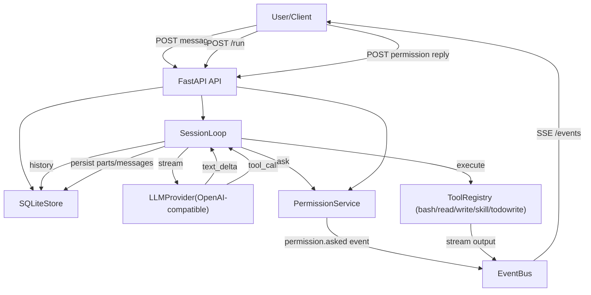

# Chord Code 项目文档（v0.1.1 MVP+）

本文档面向：
- 你（项目设计与演进）
- 参与开发的 Coding Agent（Vibe Coding 模式：模块独立、快速迭代、可替换）

> v0.1.1 MVP+ 已实现：**本地部署 + 本地运行环境（#4）**  
> LLM：OpenAI 协议兼容（例如 DeepSeek 网关）+ Chat Completions + tools + stream  
> 工具：`bash / read / write / skill / todowrite`  
> 权限：默认 `ask`  
> 存储：SQLite  
> **新增**：Part 级别追踪、中断机制、增强型前端展示、错误处理

---

## 1. 设计思想

### 1.1 目标
- **Open Code 风格内核**：Agent Loop / Tool Registry / Event Bus / Permission Gate
- **多客户端友好**：CLI / Web / Desktop / 任何自定义前端都通过事件流（SSE）接入
- **模块化适合 Vibe Coding**：每个模块单独可开发、可替换、可独立验证
- **安全默认值**：默认 ask 权限，避免“模型直接执行危险操作”
- **多运行模式可扩展**：v0.1 先 #4，本地；后续通过 runtime 适配扩展 #1/#2/#3

### 1.2 核心原则（为 Vibe Coding 服务）
- “编排”与“执行”分离：`loop` 只编排，`tools/llm/store` 做具体执行
- 事件驱动：UI/CLI 不主动轮询状态，订阅事件即可
- 所有外部副作用（shell、文件写入）都要经过 `permission` gate
- 每个 Session 有明确边界：`worktree`（绝对路径）+ 可选 `cwd`

---

## 2. 运行与配置

### 2.1 配置文件与环境变量
使用环境变量（推荐 `.env`）：
- `OPENAI_BASE_URL`：OpenAI-compatible Base URL（例如 `https://api.deepseek.com/v1`）
- `OPENAI_API_KEY`：密钥（不要提交到 git）
- `OPENAI_MODEL`：例如 `deepseek-chat`
- `CHORDCODE_DB_PATH`：SQLite 路径（默认 `./data/chordcode.sqlite3`）
- `CHORDCODE_SYSTEM_PROMPT`：全局 system prompt
- `CHORDCODE_HOOK_DEBUG`：开启 Hooks 调试日志（`1`/`true` 启用）

模板：`chord-code/.env.example`

### 2.2 启动
```bash
cd chord-code
cp .env.example .env
uv sync
uv run uvicorn chordcode.api.app:app --reload --port 4096
```

### 2.3 Web 前端
启动服务后打开：
- `http://127.0.0.1:4096/`

页面布局（3 列）：
- **Chat 窗口**（左侧，约 71% 宽度）：
  - 按 Part 类型展开渲染
  - Message Header（角色标识）+ Part 列表
  - 工具调用和结果分离展示：
    - 🔧 工具名 (call) - 显示输入参数
    - 📦 工具名 (result) - 显示输出结果
  - Tool 状态颜色区分（蓝色=running，绿色=completed，红色=error）
  - 自动隐藏内部 `role="tool"` 消息
- **Permissions 窗口**（右上）：待审批列表 + once/always/reject
- **Events 窗口**（右下）：原始 SSE 事件 JSON

前端功能：
- 创建会话、连接 SSE、发送消息、自动运行
- **中断按钮**：点击中断正在运行的 Agent（仅在 busy 状态可用）
- 实时展示 Agent 的思考过程和工具执行

---

## 3. 当前架构（模块与职责）

### 3.1 目录结构
（以 v0.1.1 为准）
- `chord-code/src/chordcode/api/`：FastAPI 路由与 SSE
- `chord-code/src/chordcode/bus/`：进程内事件总线（pub/sub）
- `chord-code/src/chordcode/config.py`：环境变量配置加载
- `chord-code/src/chordcode/llm/`：OpenAI-compatible Chat Completions 流式适配
- `chord-code/src/chordcode/loop/`：SessionLoop（核心编排）+ **InterruptManager（中断管理）**
- `chord-code/src/chordcode/model.py`：Pydantic schema（messages/parts/permission…）
- `chord-code/src/chordcode/permission/`：ask/allow/deny + approvals 持久化
- `chord-code/src/chordcode/store/`：SQLite schema + CRUD
- `chord-code/src/chordcode/tools/`：bash/read/write + registry + path/截断
- `chord-code/web/`：前端静态文件（HTML/CSS/JS）
- `chord-code/docs/`：项目文档
- `chord-code/CHANGES.md`：详细改动日志

### 3.2 核心对象
- **Session**：绑定 `worktree`（绝对路径）；工具默认在 `cwd` 执行（默认=worktree）
- **Message**：`role=user|assistant|tool`
  - 包含元信息：`agent`、`model`、`created_at`、`completed_at`、`finish`、`error`
  - 支持 `tokens` 和 `cost` 追踪（用于统计消耗）
- **Part**（每个 Part 有独立 ID，可精确追踪）：
  - `TextPart`：模型输出文本/用户输入文本
    - 字段：`id`, `message_id`, `session_id`, `text`, `synthetic`, `time`
  - `ToolPart`：工具调用的状态机（pending/running/completed/error）
    - 字段：`id`, `message_id`, `session_id`, `call_id`, `tool`, `state`
    - 状态：`ToolStatePending` → `ToolStateRunning` → `ToolStateCompleted/ToolStateError`
  - `ReasoningPart`：AI 思考过程（为 o1 等模型预留）
    - 字段：`id`, `message_id`, `session_id`, `text`, `time`
- **Event**：统一 envelope `{type, properties}`，通过 SSE 推送
  - 所有 `message.part.updated` 事件现在包含完整的 `part` 对象
  - 支持 `delta` 字段用于文本流式更新

### 3.3 数据流（从用户输入到工具执行）


### 3.4 当前能力边界（v0.1.1）
已具备：
- per-session `worktree` 边界
- 默认 ask 权限链路（含 approvals）
- OpenAI-compatible Chat Completions streaming + tool calling
- `bash/read/write/skill/todowrite` 工具
- SSE 事件流（用于 UI/CLI 实时展示）
- SQLite 持久化（会话/消息/parts/权限）
- **Hooks 机制**：可通过 Hook 扩展 Agent 核心能力
  - `config` / `event`
  - `chat.message` / `chat.params` / `chat.headers`
  - `tool.execute.before` / `tool.execute.after`
  - `permission.ask`
  - `experimental.chat.system.transform` / `experimental.chat.messages.transform`
  - Hook 定义与类型：`chord-code/src/chordcode/hookdefs.py`（`Hook` / `ALL_HOOKS` + 每个 hook 的输入输出 schema）
- **Part 级别精确追踪**：每个 Part 有独立 ID，支持增量更新
- **中断机制**：可优雅中断正在运行的 Agent Loop
- **错误处理**：完整的错误捕获和事件发布
- **增强型前端**：
  - 按 Part 类型展开渲染（Message Header → Part1 → Part2 → ...）
  - 工具调用和结果分离展示
  - 自动隐藏内部 tool role 消息
  - Tool 状态颜色区分（pending/running/completed/error）
- **Token 追踪字段**：Message 包含 `tokens` 和 `cost` 字段（待 LLM Provider 实现）

暂未实现（RoadMap 中补齐）：
- Compaction / memory / summary
- Plugin 加载机制（从本地目录/配置自动加载）
- 多线程隔离运行环境（Daytona sandbox runtime）
- 远程/混合运行（#1/#3）
- ReasoningPart 实际输出（需 LLM Provider 支持）

---

## 4. 框架能力说明（面向使用者）

### 4.1 API 概览（v0.1.1）
（路径见 `chord-code/src/chordcode/api/app.py`）
- `POST /sessions`：创建 session（传入 `worktree`）
- `POST /sessions/{session_id}/messages`：追加 user message（当前仅支持 `{"text": ...}`）
- `POST /sessions/{session_id}/run`：启动/继续 loop（生成 assistant）
- **`POST /sessions/{session_id}/interrupt`**：中断正在运行的 session（新增）
- `GET /events?session_id=...`：SSE 订阅事件
- `GET /sessions/{session_id}`：获取 session 信息
- `GET /sessions/{session_id}/messages`：拉取历史
- `GET /permissions/pending?session_id=...`：查询待审批权限请求
- `POST /permissions/{request_id}/reply`：回复权限（once/always/reject）

### 4.2 事件（SSE）
事件统一格式：
```json
{"type":"message.part.updated","properties":{...}}
```

常见事件：

**会话级别**：
- `session.created`：会话创建
- `session.status`：状态变化（`busy` / `idle`）
- `session.error`：会话级错误（包含 `error.message`, `error.type`, `error.context`）
- **`session.interrupted`**：会话被中断（新增）

**消息级别**：
- `message.updated`：消息信息更新（包含完整 `info` 对象）
- `message.removed`：消息删除

**Part 级别**（重要变更）：
- `message.part.updated`：Part 更新
  - `properties.part`：**完整的 Part 对象**（包含 `id`, `type`, `message_id`, `session_id` 等）
  - `properties.delta`：文本增量（仅 TextPart 流式更新时存在）
  - Part 类型：`text` / `tool` / `reasoning`
- `message.part.removed`：Part 删除

**权限级别**：
- `permission.asked`：权限请求
- `permission.replied`：权限回复

**事件结构示例**：
```json
{
  "type": "message.part.updated",
  "properties": {
    "session_id": "abc123",
    "message_id": "msg456",
    "part": {
      "id": "part789",
      "message_id": "msg456",
      "session_id": "abc123",
      "type": "tool",
      "call_id": "call_xxx",
      "tool": "bash",
      "state": {
        "status": "completed",
        "input": {"command": "ls -la"},
        "title": "bash",
        "output": "total 48\n...",
        "metadata": {},
        "time": {"start": 1234567890, "end": 1234567891}
      }
    }
  }
}
```

### 4.3 权限模型（默认 ask）
v0.1 建议的权限类别：
- `bash`：执行命令（按命令/前缀）
- `read`：读文件（绝对路径）
- `write`：写文件（绝对路径）
- `skill`：加载技能正文（按技能名）
- `external_directory`：访问 worktree 外路径

默认规则（不配置时）：
- `*` / `*` → `ask`

“always” 的效果：
- 写入 `permission_approvals`，后续同 session 匹配到就直接 allow

### 4.4 工具系统（Tool Registry）
工具是 LLM 可以调用的 function tool。
每个工具提供：
- `name`
- `description`
- `schema()` → JSON Schema（给 LLM 做参数生成/校验）
- `execute(args, ctx)` → `ToolResult`

工具上下文最关键的能力：
- `ctx.ask(...)`：触发权限 gate
- `ctx.tool_stream_update(output)`：把执行过程中的输出推到事件总线（用于 UI 流式展示）

### 4.4.1 Skills（按需加载）

- 发现范围（仅 worktree 内）：`skills/`、`.claude/skills/`、`.agents/skills/`、`.opencode/skill/`、`.opencode/skills/`
- 每个技能目录需包含 `SKILL.md`，且需 YAML frontmatter：
  - `name`（必填，且必须与目录名一致，regex：`^[a-z0-9]+(-[a-z0-9]+)*$`）
  - `description`（必填，长度 1~1024）
- 运行时策略：
  - `skill` 工具 description 仅暴露 `<available_skills>`（name/description/location）
  - 模型按需调用 `skill(name=...)` 后，正文作为 tool result 注入后续上下文
  - `permission=skill` 生效；命中 `deny` 的技能不会暴露在可用列表中

### 4.5 前端渲染逻辑（Part-based Display）

**设计原则**：
- 一个 Message 不是一个气泡，而是 `Message Header + Parts`
- 每个 Part 独立渲染，有自己的样式和状态
- `role="tool"` 的 message 不显示（仅供 LLM 上下文使用）

**渲染流程**：
1. 遍历所有 `role != "tool"` 的 Message
2. 渲染 Message Header（显示角色、状态、ID）
3. 遍历该 Message 的所有 Parts，按类型渲染：
   - **TextPart** → 💬 Text 气泡
   - **ToolPart (completed)** → 分成两个气泡：
     - 🔧 工具名 (call) - 显示输入参数
     - 📦 工具名 (result) - 显示输出结果
   - **ToolPart (pending/running/error)** → 单个气泡，显示状态
   - **ReasoningPart** → 🤔 Reasoning 气泡

**视觉效果**：
```
┌─ MESSAGE: user ─────────────────┐  ← Message Header
└─────────────────────────────────┘
  ├─ 💬 Text                          ← TextPart
  │  当前文件夹有哪些文件？
  
┌─ MESSAGE: assistant ────────────┐  ← Message Header
└─────────────────────────────────┘
  ├─ 💬 Text                          ← TextPart
  │  我将执行一个命令...
  │
  ├─ 🔧 bash (call)                   ← ToolPart - 调用
  │  {"command": "ls -la"}
  │
  ├─ 📦 bash (result)                 ← ToolPart - 结果
  │  total 48
  │  drwxr-xr-x  12 user  staff   384 Feb  4 10:00 .
  │  ...
  │
  └─ 💬 Text                          ← TextPart
     当前文件夹包含以下主要文件和目录：...
```

**状态颜色**：
- 🔵 `tool-call` - 蓝色边框（调用请求）
- 🟡 `tool-running` - 黄色/蓝色边框（执行中）
- 🟢 `tool-completed` - 绿色边框（成功）
- 🔴 `tool-error` - 红色边框（失败）

---

## 5. 开发指南（面向 Vibe Coding 的 Agent）

### 5.1 推荐的开发节奏（模块隔离）
把任务拆成“只动一个模块”的最小迭代：
- 只改 `tools`：新增工具、不改 loop/llm/store
- 只改 `llm`：新增 provider 或修复 tool-calls 聚合逻辑
- 只改 `permission`：规则匹配、审批 UX、批量审批
- 只改 `api`：新增端点/改 SSE 过滤
- 只改 `store`：新增字段/迁移（保持向后兼容）

### 5.2 开发约束（让 Coding Agent 更稳定）
建议硬性规则：
- 不要把密钥写入代码、日志、示例请求
- 任何外部副作用（bash/write）必须先 `ctx.ask`
- 任何“跨 worktree”访问必须先 `external_directory` ask
- 工具输出必须可截断（避免 SSE/DB 巨大 payload）

### 5.3 如何新增一个 Tool（示例流程）
目标：新增 `ls` 工具（示例）
1) 在 `chord-code/src/chordcode/tools/` 新建 `ls.py`
2) 实现 `name/description/schema/execute`
3) 在 `api/app.py` 里组装 `ToolRegistry([...])` 时加入该工具实例
4) 运行后让模型调用它：观察 SSE `message.part.updated` 中 tool 状态变化

### 5.4 如何新增一个 LLM Provider（保持 loop 不变）
1) 在 `chord-code/src/chordcode/llm/` 新建 provider
2) 输出同样的事件类型：`text_delta/tool_call/finish/error`
3) API 启动时注入不同 provider 实例

### 5.5 如何新增一个客户端
客户端只需要：
- SSE 订阅 `GET /events?session_id=...`
- 能提交 message、run、permission reply

最小 CLI 客户端可用 curl 实现；后续可做 `chordcode-cli`。

### 5.6 中断机制的实现细节
中断功能由 `InterruptManager` 提供，允许优雅停止正在运行的 Agent Loop。

**工作流程**：
1. 前端点击 "Interrupt" 按钮 → `POST /sessions/{session_id}/interrupt`
2. API 调用 `InterruptManager.interrupt(session_id, reason="user_cancelled")`
3. Loop 在每次迭代和 LLM 流式响应中检查 `is_interrupted(session_id)`
4. 如果检测到中断：
   - 停止当前操作
   - 更新 Message 状态为 `finish="interrupted"`
   - 发布 `session.status: idle` 事件
   - 清除中断信号

**关键检查点**：
- Loop 开始前清除旧中断信号
- 每次 while 循环开始前检查
- LLM 流式响应中每次 delta 后检查

**前端状态管理**：
- 监听 `session.status` 事件
- `busy` 状态时启用 Interrupt 按钮
- `idle` 状态时禁用 Interrupt 按钮

### 5.7 Debug Playbook
常见问题定位顺序：
1) SSE 是否有 `permission.asked` → 说明卡在审批
2) `permission/pending` 是否出现记录 → 是否能 reply
3) `message.part.updated` 是否不断出现 delta → LLM 流式是否正常
4) `message.part.updated` 中 `part` 对象是否完整 → 事件结构是否正确
5) 前端是否正确按 Part 类型渲染 → 检查 `part.type` 和 `part.id`
6) `tool_stream` 事件是否出现 → bash 流式是否正常
7) `GET /sessions/{id}/messages` 查看落库历史是否完整
8) `session.error` 事件是否出现 → 错误处理是否触发

---

## 6. RoadMap（建议）

### ✅ v0.1（完成）
- 本地服务（FastAPI）
- OpenAI-compatible Chat Completions + tool calling + stream
- SQLite 落库
- SSE 事件总线
- `bash/read/write` 工具 + 默认 ask 权限
- per-session worktree 边界

### ✅ v0.1.1（当前 - 完成）
- **Part 模型增强**：独立 ID、时间戳、完整事件结构
- **中断机制**：`InterruptManager` + `/interrupt` API + 前端按钮
- **错误处理**：完整的 try-catch + `session.error` 事件
- **前端重构**：按 Part 类型展开、工具调用/结果分离、状态颜色区分
- **ReasoningPart** 类型定义（待 LLM Provider 支持）
- **Token 追踪字段**（待实现计算逻辑）

### v0.2（Hooks & Plugin System - 🔴 极高优先级）
**目标**：建立可扩展的 Agent Core 架构基础

核心能力：
- **Plugin 加载机制**
  - 本地插件目录（`.chordcode/plugins/`）
  - 配置文件定义插件
  - 动态加载 Python 模块
- **Hooks 系统（已落地基础版）**
  - `config` / `event` - 配置和事件订阅
  - `chat.message` / `chat.params` / `chat.headers` - 消息与 LLM 请求参数
  - `tool.execute.before` / `tool.execute.after` - 工具生命周期
  - `permission.ask` - 权限控制
  - `experimental.chat.system.transform` / `experimental.chat.messages.transform` - Prompt/消息变换
  - 后续补齐：自定义工具注册、更多生命周期钩子、错误隔离
- **Plugin 管理器**
  - 加载、触发、获取工具
  - Hook 链执行
  - 错误隔离

**为什么优先？** Hooks 是插件化扩展（自定义工具、权限策略、system prompt 变换等）的基础；MCP/Skills 等能力可以先作为内置模块落地，后续再通过 Hooks 做可插拔/可覆盖。

### v0.3（Multi-Agent Architecture - 🔴 极高优先级）
**目标**：支持不同任务模式和权限隔离

核心能力：
- **Agent 定义系统**
  - 内置 Agent：`build`（默认）、`plan`（只读）、`explore`（快速探索）
  - 每个 Agent 独立权限规则和系统 prompt
  - 支持 `primary` / `subagent` / `hidden` 模式
- **Agent 注册表**
  - 动态注册和查询
  - 配置文件定义自定义 Agent
- **`task` 工具**（启动子 Agent）
  - 创建子 Session
  - 子任务结果通过摘要返回
  - 避免上下文污染

**为什么优先？** 不同任务需要不同行为模式，Multi-Agent 是复杂任务编排的基础。

### v0.4（Context Compaction - 🟡 高优先级）
**目标**：支持长对话

核心能力：
- 专门的 Compaction Agent
- 自动触发机制（上下文达到 80% 时）
- 旧消息压缩为摘要
- Compaction Hook 支持

### v0.5（MCP Integration - 🟡 高优先级）
**目标**：扩展外部工具生态

核心能力：
- **MCP 客户端**
  - 支持 stdio、HTTP、SSE 传输
  - OAuth 认证流程
  - 工具列表动态加载
- **MCP 配置**
  - 本地和远程 MCP 服务器
  - 凭据管理
- **MCP 工具包装**
  - 包装为标准 Tool
  - 权限系统集成

### v0.6（Skill System - 🟡 高优先级）
**目标**：可复用的“说明文档能力”（按需注入上下文）

核心能力：
- **Agent Skill（`SKILL.md`）是什么**：本质是“可版本化的操作手册/领域指南”，不是插件、也不是代码；它通过 `skill` 工具被按需加载进对话上下文
- **Skill 发现（discovery）**：从当前 `cwd` 向上遍历到 git worktree，收集沿途的 `.chordcode/` 目录并扫描其中 `{skill,skills}/**/SKILL.md`；可选兼容 `.claude/skills/**/SKILL.md`；并支持全局 `~/.config/chordcode/skills/**/SKILL.md`（可选：`~/.claude/skills/**/SKILL.md`）
- **`skill` 工具（按需加载，而非全量注入）**
  - 工具 description 内嵌 `<available_skills>`（name + description），让模型先“选 skill 再加载内容”
  - `skill({name})` 读取对应 `SKILL.md` 正文（附带 base directory），作为工具输出进入上下文
  - 采用单工具设计：不额外提供 `skills` 发现工具，避免能力重叠
- **权限集成**：`permission.skill` 以 pattern 控制 `allow/deny/ask`；`deny` 的 skill 对模型不可见（不会出现在 `<available_skills>`）
  - 可选：支持 per-agent 覆盖权限与禁用 `skill` 工具（某些 agent 不应加载任何 skills）

### v0.7（Advanced Features - 🟢 中优先级）
- **Snapshot/Diff 追踪**：文件变更追踪和上下文
- **Provider Transform**：统一不同 LLM 接口
- **Token 计算实现**：实际统计和成本追踪
- **ReasoningPart 输出**：支持 o1 等模型
- CLI 客户端增强
- 前端功能完善

### v0.8+（Multiple Runtimes - 长期规划）
**注意**：这是未来重点，但需要先完成 Agent Core

- **Remote Runtime**：云端 Core + 本地客户端
- **Sandbox Runtime**：独立沙箱环境（Docker / Daytona）
- **Hybrid Runtime**：云端 Core + 本地工具代理

---

**📋 详细规划**：参见 `docs/agent-core-roadmap.md` - 包含完整的能力对比、实施建议和代码示例

---

## 7. v0.1.1 重要更新总结（2026-02-04）

### 后端改进
1. **Part 模型重构**：
   - 所有 Part 现在有独立的 `id`, `message_id`, `session_id`
   - 新增 `ReasoningPart` 类型（为 o1 等模型预留）
   - Message 添加 `tokens` 和 `cost` 字段

2. **中断机制**：
   - 新增 `InterruptManager` 类管理中断信号
   - Loop 在关键点检查中断状态
   - 支持优雅停止正在运行的 Agent

3. **事件总线完善**：
   - `message.part.updated` 事件现在包含完整 `part` 对象
   - 保留 `delta` 字段用于文本流式更新
   - 新增 `session.error` 和 `session.interrupted` 事件

4. **错误处理增强**：
   - Loop 启动和 LLM 流式响应包裹 try-catch
   - 所有错误发布 `session.error` 事件
   - 错误时自动更新会话状态

### 前端改进
1. **按 Part 展开渲染**：
   - Message Header + Part 列表的新结构
   - 工具调用和结果分成两个独立气泡
   - 自动隐藏内部 `role="tool"` 消息

2. **视觉优化**：
   - Tool 状态颜色区分（pending/running/completed/error）
   - Chat 窗口扩大到约 71% 宽度
   - 更清晰的视觉层次

3. **功能增强**：
   - 中断按钮（仅在 busy 状态可用）
   - 实时状态管理
   - 错误监听和日志

### 对比 OpenCode
**已实现的核心能力**：
- ✅ 事件驱动架构
- ✅ Part 级别精确追踪
- ✅ 流式响应和实时展示
- ✅ 中断机制
- ✅ 完整的错误处理

**待实现**：
- 🔶 Context Compaction（长对话支持）
- 🔶 多 Agent 编排
- 🔶 Snapshot/Diff 追踪
- 🔶 LSP 集成
- 🔶 更多工具（web search、code search 等）

---

## 8. 关键文件索引（读代码从这里开始）

**后端核心**：
- API：`chord-code/src/chordcode/api/app.py`
- Loop：`chord-code/src/chordcode/loop/session_loop.py`
- **Interrupt**：`chord-code/src/chordcode/loop/interrupt.py`（中断管理，v0.1.1 新增）
- LLM：`chord-code/src/chordcode/llm/openai_chat.py`
- Tools：`chord-code/src/chordcode/tools/`
- Permission：`chord-code/src/chordcode/permission/service.py`
- Store：`chord-code/src/chordcode/store/sqlite.py`
- Model：`chord-code/src/chordcode/model.py`（核心数据结构，包含 Part 定义）

**前端**：
- HTML：`chord-code/web/index.html`
- JS：`chord-code/web/app.js`（事件处理和 Part-based 渲染逻辑）
- CSS：`chord-code/web/styles.css`（包含 Part 状态颜色等样式）

**文档**：
- 项目文档：`chord-code/docs/project.md`（本文件）
- 改动日志：`chord-code/CHANGES.md`（v0.1.1 详细改进说明）

---

**最后更新**：2026-02-04  
**当前版本**：v0.1.1 MVP+  
**状态**：生产可用（本地部署）
